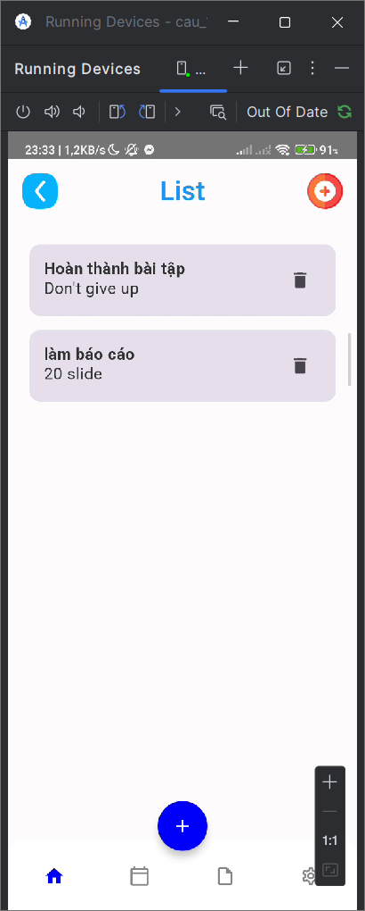
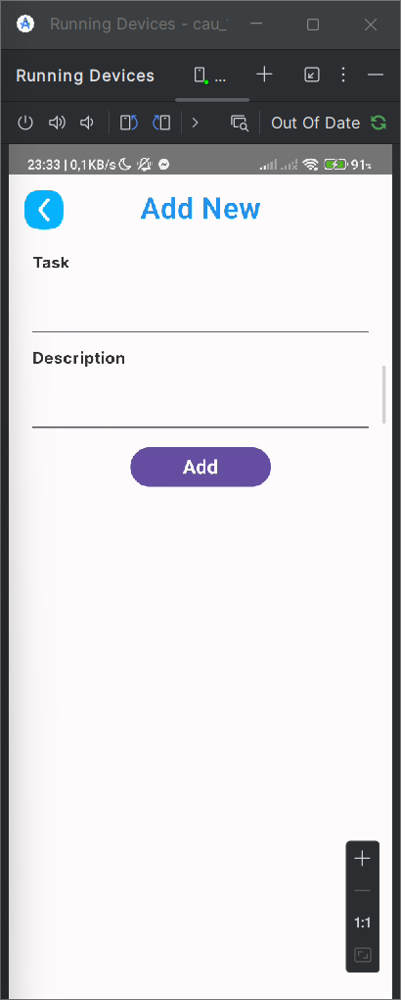

# 083205004013_NguyenHoHoangPhuc_Baitap6
## Câu 1:
- Model: Repository quản lý Json trên thiết bị và task_model chứa data class.
- View: chứa các screen và navagation.
- ModelView: cung cấp dữ liệu và xử lý logic.
## Hình ảnh mô tả cho câu 2:
- ListScreen:
- 
- AddScreen:
- 